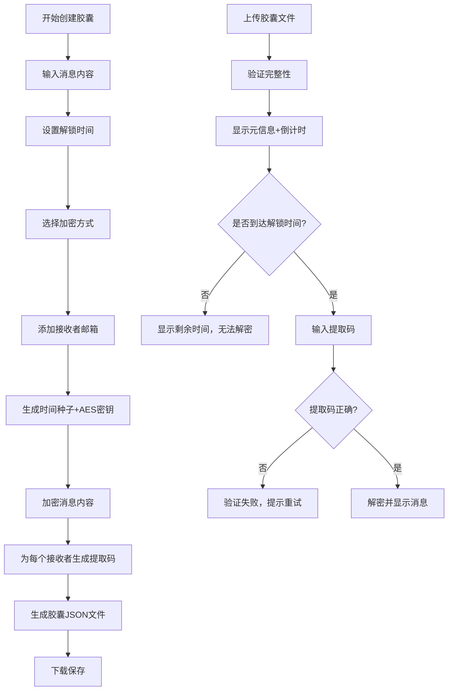

## 1. 产品概述

时间胶囊是一款基于Web的消息加密与解密工具，用户可以创建加密的时间胶囊，将消息封印其中，只有到达预设的解锁时间后才能解密阅读。

- 核心价值：为用户提供一种具有仪式感的信息传递方式，结合密码学原理确保消息在指定时间前无法被阅读
- 目标用户：需要给未来的自己或他人发送消息、希望为重要时刻准备惊喜、喜欢数字收藏和仪式感的互联网用户

## 2. 核心特性

### 2.1 用户角色

| 角色 | 注册方式 | 核心权限 |
|------|---------|---------|
| 普通用户 | 无需注册，直接使用 | 创建胶囊、解密胶囊、查看胶囊广场、点赞评论、导出数据 |

### 2.2 功能模块

1. **创建胶囊页面**：消息输入、解锁时间设置、加密方式选择、接收者添加、胶囊生成与下载
2. **解密胶囊页面**：文件上传、提取码验证、倒计时显示、消息解密展示
3. **胶囊广场页面**：公开胶囊列表、解锁倒计时、点赞评论交互
4. **通用功能**：完整性验证、数据导出、本地存储

### 2.3 页面详情

| 页面名称 | 模块名称 | 功能描述 |
|---------|---------|----------|
| 创建胶囊 | 表单模块 | 消息文本输入、解锁日期时间选择、加密算法选择、是否公开开关 |
| 创建胶囊 | 接收者管理 | 添加/删除接收者邮箱、自动生成唯一提取码 |
| 创建胶囊 | 胶囊生成 | 基于时间的AES加密、文件下载、胶囊预览 |
| 解密胶囊 | 文件上传 | JSON文件拖拽上传、解析与完整性校验 |
| 解密胶囊 | 信息展示 | 元信息展示（创建者、倒计时、接收者列表）、消息内容隐藏 |
| 解密胶囊 | 解密交互 | 提取码输入、时间验证、消息解密展示 |
| 胶囊广场 | 列表展示 | 公开胶囊卡片网格、解锁倒计时动态显示 |
| 胶囊广场 | 交互模块 | 点赞、评论（本地存储）、查看详情 |
| 通用 | 数据导出 | 导出所有胶囊数据为可移植的单一文件 |
| 通用 | 完整性验证 | HASH校验确保胶囊文件未被篡改 |

## 3. 核心流程

用户创建时间胶囊：填写消息内容 → 设置解锁时间 → 选择加密方式 → 添加接收者 → 系统生成加密密钥 → 加密消息 → 生成提取码 → 导出JSON文件

用户解密时间胶囊：上传JSON文件 → 验证完整性 → 显示元信息和倒计时 → 到达解锁时间 → 输入提取码 → 验证通过 → 解密并显示消息

## 4. 用户界面设计

### 4.1 设计风格

**设计主题：科技未来主义 + 时间仪式感**

- **主色调**：深空蓝 (#0a0e27) 作为背景主色，营造宇宙/时间的深邃感
- **强调色**：霓虹紫 (#8b5cf6) 和 霓虹青 (#06b6d4) 作为交互元素，体现科技感
- **警示色**：霓虹粉 (#ec4899) 用于重要状态提示
- **渐变效果**：使用紫青渐变作为主强调，营造时间流动感

- **按钮风格**：圆角矩形按钮，带有发光边框和悬停时的光晕扩散动画
- **字体**：使用 JetBrains Mono 作为等宽字体（代码/时间显示），Noto Sans SC 作为中文正文字体
- **布局风格**：卡片式布局，带有玻璃拟态（Glassmorphism）效果，模糊背景透出渐变光晕
- **图标风格**：使用简约线条图标，配合emoji增强情感表达 ⏳🔐✨

- **特殊视觉元素**：动态倒计时数字、粒子背景效果、胶囊解锁时的动画过渡

### 4.2 页面设计概述

| 页面名称 | 模块名称 | UI元素 |
|---------|---------|--------|
| 创建胶囊 | 表单区域 | 玻璃拟态卡片、渐变输入框、日期选择器、邮箱标签 |
| 创建胶囊 | 加密设置 | 加密方式选择卡片、算法说明、安全提示 |
| 创建胶囊 | 生成预览 | 胶囊生成动画、文件下载按钮、提取码展示 |
| 解密胶囊 | 上传区域 | 拖拽上传框、文件图标、解析进度条 |
| 解密胶囊 | 信息展示 | 倒计时大号数字、接收者列表、胶囊元数据 |
| 解密胶囊 | 解密区域 | 提取码输入框、解密按钮、消息展示动画 |
| 胶囊广场 | 胶囊网格 | 响应式卡片网格、倒计时徽章、点赞评论区 |
| 胶囊广场 | 筛选排序 | 时间筛选、点赞排序、公开/全部切换 |

### 4.3 响应式设计

- 采用 Desktop-first 设计，优先保证桌面端的视觉体验
- 移动端适配：卡片堆叠布局、字号自适应、触摸区域优化（最小44px）
- 断点设置：1200px（桌面）、768px（平板）、480px（手机）
- 移动端禁用部分复杂动画，保证性能

### 4.4 动画与交互

- **页面加载**：元素从底部渐入，配合透明度和位移动画
- **倒计时**：数字变化时的翻转动画，接近解锁时间时变为红色脉冲
- **胶囊解锁**：从锁定图标到解锁图标的过渡动画，伴随光晕扩散
- **按钮悬停**：背景色渐变、边框发光、轻微上浮
- **消息解密**：文字从模糊到清晰的渐显动画
