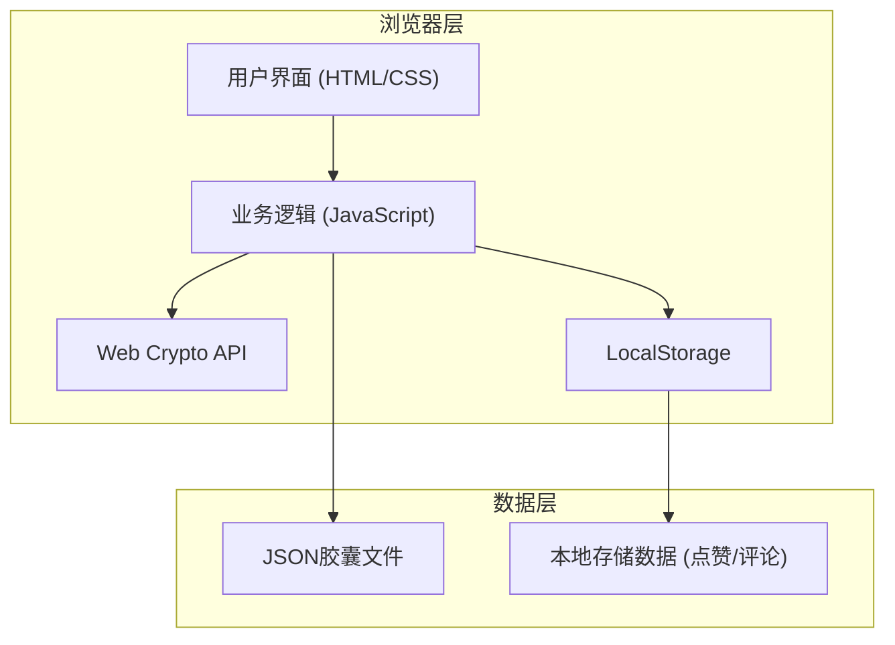

## 1. 架构设计

这是一个纯前端的单页应用，所有逻辑在浏览器端执行，无需后端服务。数据通过浏览器本地存储和JSON文件进行持久化。



## 2. 技术选型

- **前端框架**：原生 HTML5 + CSS3 + JavaScript (ES6+)，无需任何前端框架
- **加密库**：浏览器内置 Web Crypto API (AES-GCM + SHA-256)
- **样式方案**：原生 CSS，使用 CSS 变量和 Grid/Flexbox 布局
- **存储方案**：浏览器 LocalStorage 存储用户数据，JSON 文件用于胶囊导出
- **外部依赖**：无外部库依赖，纯原生实现
- **字体**：Google Fonts (JetBrains Mono + Noto Sans SC)

## 3. 页面结构

| 页面/视图 | 文件位置 | 主要功能 |
|----------|---------|---------|
| 主页面 | index.html | 导航容器，通过JS切换视图 |
| 创建胶囊视图 | js/views/create.js | 创建胶囊表单逻辑 |
| 解密胶囊视图 | js/views/decrypt.js | 解密胶囊逻辑 |
| 胶囊广场视图 | js/views/plaza.js | 公开胶囊列表展示 |

## 4. 目录结构

```
├── index.html              # 主入口文件
├── css/
│   ├── style.css           # 全局样式
│   ├── variables.css       # CSS变量定义
│   └── animations.css      # 动画定义
├── js/
│   ├── main.js             # 应用入口
│   ├── crypto/
│   │   ├── aes.js          # AES加密解密
│   │   ├── keygen.js       # 密钥生成（基于时间戳）
│   │   └── hash.js         # HASH校验（完整性验证）
│   ├── models/
│   │   └── capsule.js      # 胶囊数据模型
│   ├── views/
│   │   ├── create.js       # 创建胶囊视图
│   │   ├── decrypt.js      # 解密胶囊视图
│   │   └── plaza.js        # 胶囊广场视图
│   ├── utils/
│   │   ├── storage.js      # 本地存储工具
│   │   ├── file.js         # 文件读写工具
│   │   └── time.js         # 时间处理工具
│   └── components/
│       ├── countdown.js    # 倒计时组件
│       └── notification.js # 通知组件
└── data/
    └── mock-capsules.json  # 广场示例数据
```

## 5. 核心数据模型

### 5.1 胶囊数据结构

```javascript
{
  "id": "uuid-string",
  "version": "1.0",
  "meta": {
    "title": "胶囊标题",
    "creator": "创建者名称",
    "createdAt": 1234567890,
    "unlockAt": 1234567890,
    "isPublic": true,
    "encryption": {
      "algorithm": "AES-GCM",
      "keySeed": 1234567890,
      "iterations": 100000
    }
  },
  "recipients": [
    {
      "email": "user@example.com",
      "extractCode": "ABC123XYZ",
      "codeHash": "sha256-hash"
    }
  ],
  "data": {
    "ciphertext": "base64-encoded-encrypted-message",
    "iv": "base64-initialization-vector",
    "tag": "base64-auth-tag"
  },
  "integrity": {
    "hash": "sha256-of-meta+recipients+data",
    "signature": "optional-hmac"
  }
}
```

### 5.2 本地存储数据结构

```javascript
{
  "capsules": {
    "capsule-uuid": {
      "likes": 42,
      "liked": true,
      "comments": [
        {
          "id": "comment-id",
          "author": "昵称",
          "content": "评论内容",
          "createdAt": 1234567890
        }
      ]
    }
  },
  "myCapsules": ["capsule-uuid-1", "capsule-uuid-2"],
  "settings": {
    "theme": "dark",
    "notifications": true
  }
}
```

## 6. 加密算法设计

### 6.1 密钥生成流程

1. 获取当前 Unix 时间戳作为初始种子
2. 结合解锁时间戳进行混合运算：`seed = createTimestamp ^ unlockTimestamp`
3. 使用 PBKDF2 进行密钥派生：
   - 盐值：胶囊 ID 的 SHA-256 哈希
   - 迭代次数：100,000 次
   - 输出长度：256位（AES-256 密钥）

### 6.2 加密流程

1. 生成随机 12 字节的初始化向量 (IV)
2. 使用 AES-GCM 算法加密明文消息
3. 输出密文、IV 和认证标签 (Auth Tag)

### 6.3 解密条件

- 当前系统时间 >= 解锁时间
- 提取码的 SHA-256 哈希与存储的哈希匹配
- 完整性校验通过

### 6.4 完整性验证

对 `meta + recipients + data` 字段进行 SHA-256 哈希，与 `integrity.hash` 对比，确保数据未被篡改。

## 7. 核心模块说明

### 7.1 加密模块 (crypto/)

- `keygen.js`: 基于时间戳的密钥生成
- `aes.js`: AES-GCM 加解密封装
- `hash.js`: SHA-256 哈希和完整性校验

### 7.2 视图模块 (views/)

- `create.js`: 创建胶囊表单、验证、生成、下载
- `decrypt.js`: 文件上传、解析、倒计时、解密展示
- `plaza.js`: 公开胶囊列表、筛选、点赞评论

### 7.3 工具模块 (utils/)

- `storage.js`: LocalStorage 读写封装
- `file.js`: JSON 文件导入导出
- `time.js`: 时间格式化、倒计时计算

## 8. 安全考虑

1. 所有加密操作在浏览器端执行，密钥不上传服务器
2. 提取码仅存储哈希值，不存储明文
3. 使用 AES-GCM 提供机密性和完整性双重保护
4. 提醒用户：浏览器时间可能被篡改，重要数据请配合其他验证方式
5. 导出的 JSON 文件包含加密内容，建议用户妥善保管
